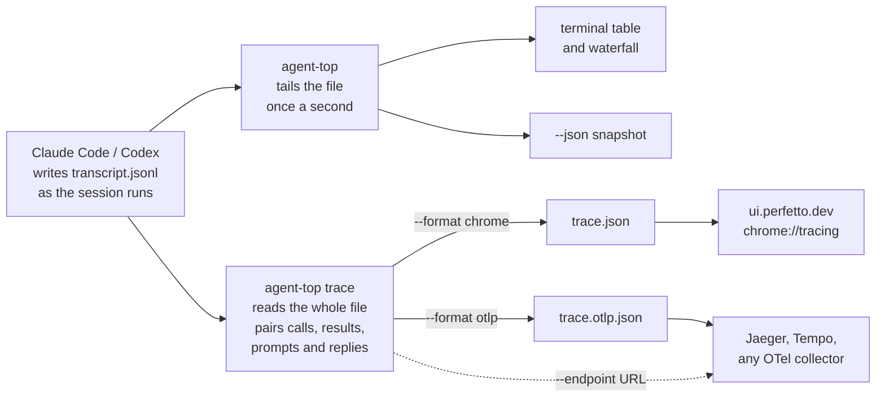

# agent-top

**htop for local coding agents.**

[](https://github.com/kannandreams/agent-top/actions/workflows/ci.yml)
[](https://crates.io/crates/agent-top)
[](LICENSE)
[](Cargo.toml)

`agent-top` is a terminal dashboard for the coding agents running on your machine. It reads the transcripts the harnesses already write and the process table the OS already keeps, then shows every Claude Code, Codex, Gemini CLI and OpenCode session in one place: what each one is doing, how many tokens and dollars it has spent, and which helper processes it has left behind.

Coding agents have become long-running processes, and you tend to keep several at once, each in its own window with its own cost and its own leaks. No single harness shows them together. `agent-top` does, the way `htop` does it for processes and `btop` for the whole machine. At a glance you can see which agent is burning tokens, which is waiting on you, and which MCP server is still alive after the agent that started it died.


<sub>Recorded from a synthetic snapshot (`docs/demo-snapshot.json`, replayed with `--replay`) rather than a live machine, because a recording of real sessions would publish real project names, working directories and session ids. Regenerate with `vhs docs/demo.tape`.</sub>

## Key features

- **Every harness in one view.** Claude Code, Codex, Gemini CLI and OpenCode sessions in a single table, live or recently stopped, so you never tab between four tools to see what is running.
- **Real tokens and cost.** Counted from the harness's own transcript, never estimated, and priced from a table you can read and edit (Anthropic, OpenAI and Google list prices). Subagents are folded into their parent.
- **[`agent-top report`](#what-it-all-costs-agent-top-report).** What all of it has cost, across every harness, from the transcripts on disk, grouped by harness, model, project or day. The one place that adds your agent spend up together.
- **MCP leak detection.** One row per MCP server with its call count, and orphaned servers, the memory leak this tool exists to catch, flagged in red with the agent they were orphaned from.
- **Context by source.** Which tool's results are filling the prompt, and what re-reading them on every response since has cost: a `Read` that returned 40k tokens is billed again on every turn for the rest of the session, and no harness shows that. Computed from the usage records alone; no tool output is read.
- **Tool trace, and OpenTelemetry export.** A waterfall of every tool call, inference and turn, reconstructed from the transcript with no telemetry to switch on. Export it as a Chrome trace for Perfetto, or as OTLP JSON, and `trace --endpoint <url>` posts it straight to Jaeger, Tempo or any OpenTelemetry collector.
- **Signals the harnesses hide.** How close each agent is to its rate limit (Codex), how much of each prompt is served from cheap cache versus paid at full price, and your live spend velocity in dollars-per-hour across every agent at once.
- **Read-only and self-contained.** Reads the files the harnesses already write and the process table the OS already keeps. No daemon, no configuration, one static binary; it never writes to or kills an agent, and your data never leaves the machine. The only network calls it makes carry none of your data: a daily update check (turn off with `AGENT_TOP_NO_UPDATE_CHECK=1`) and the `trace --endpoint` you type.

## Quick start

```sh
brew install kannandreams/tap/agent-top   # or: cargo binstall agent-top
agent-top
```

That is the whole setup. There is nothing to configure and nothing to enable
in your agents: `agent-top` reads the transcripts the harnesses already write
and the process table the OS already keeps. Start it in any terminal while
your agents run.

What to look at first:

- **STATE** tells you who is working and who is waiting for you.
- **COST** is what each session has spent so far, at list price.
- **Red rows in the detail pane** are MCP servers whose agent has gone. They are the leak this tool exists to catch.

Keys: `j`/`k` move, `Tab` switches the detail pane between the process tree and the tool trace, `s` sorts, `x` hides stopped sessions, `l` opens the slowest-tools panel, `f` the failed-tools panel, `a` the advice panel, `?` shows the rest, `q` quits.

Other ways to run it:

```sh
agent-top --once             # print the table once and exit
agent-top --json             # one snapshot as JSON, for scripts and bug reports
agent-top trace --session 662cda1f -o trace.json   # one session as a trace file for Perfetto
agent-top report --since 7d  # what every harness cost this week, in one place
agent-top --prices           # the price table in use, and where each row came from
agent-top --whats-new        # recent changelog for this build, and how to upgrade
AGENT_TOP_NO_UPDATE_CHECK=1   # env var: disable the daily update check entirely
```

## What the table shows

| Column | Meaning |
|:--|:--|
| 🚦&nbsp;**STATE** | `running` = mid-turn (inference or tool execution), `idle` = alive and waiting for you, `stopped` = transcript with no live process (kept for 30 minutes) |
| 🔢&nbsp;**TOKENS** | input + cache read + cache write + output, from the harness's own transcript |
| 💰&nbsp;**COST** | USD at list price, from [the price table](#prices). `+` or `≥` means some tokens had no known price and the number is a floor; `n/a` means none of them did |
| 🖥️&nbsp;**CPU%&nbsp;/&nbsp;MEM** | summed over the agent's whole process tree |
| 🔧&nbsp;**TOOLS** | tool calls in the session |
| 🧩&nbsp;**PROCS&nbsp;/&nbsp;MCP** | processes in the tree, and how many of them look like Model Context Protocol servers |
| ⏱️&nbsp;**AGE** | process age, or time since the last transcript write for stopped sessions |

A Claude Code session's subagents are folded into its row, the way Claude
Code's own cost display counts them. Web searches the model ran are counted
and, for Claude Code, priced.

## The detail pane

Press `t` to open it and `Tab` to switch between two views.

**Process tree.** Every process under the agent, labelled `agent`, `subagent`,
`mcp`, `shell` or `tool`, with the token breakdown beside it.

**MCP servers.** Below the tree, one line per MCP server the agent uses: the
server's pid, how many times the agent has called it, how many of those calls
failed, when it was last called, and its CPU and memory. The call counts come
from the transcript, where each harness names the server in its own way:
Claude Code names an MCP tool `mcp__<server>__<tool>`, Gemini
`mcp_<server>_<tool>`, and Codex records the server name directly. The process
comes from the tree, and the two are joined by name. When that join is a guess
the pid carries a `?`. A server the agent calls but that has no process, such
as an HTTP server or one that has already exited, shows with no pid.

```
 mcp servers   calls from the transcript; pid? = process guessed
   server            pid calls err last call   cpu    rss
   filesystem       5001    17   2    1m ago  0.2%    40M
   linear              -     3   0         -     -      -
```

**Context by source.** Under the servers, what each tool's results have added
to the prompt and what that has cost. Every response re-reads the whole
conversation, so a tool result is paid for not once but on every response
after it until the context is compacted; a single large `Read` or an MCP
server that returns a page of JSON per call can quietly become the biggest
line in the bill. The section lists sources largest first: built-in tools by
name, MCP servers as `mcp <server>`, and one row, `prompts & replies`, for the
system prompt, your messages and the model's own replies.

```
 context   what each tool's results added to the prompt, and its cost since
   source            calls   added     cost
   mcp scratchfs        17    1.2M   $38.10
   Read                 84    812k   $22.00
   prompts & replies     -   56.7k    $1.70
```

The tokens are the growth of the prompt between one response and the next,
attributed to the tool results submitted in between (split evenly when several
were answered together, which is a heuristic); the cost is those tokens at each
later response's own prompt rate, mostly the cache-read price. The rows sum to
the session's prompt-side cost. Nothing is read from a tool result itself,
only how much bigger the next prompt was. See
[accounting.md](docs/accounting.md#context-by-source) for the arithmetic and
its limits. `agent-top --once` lists the top sources per agent under
`CONTEXT BY SOURCE`; `--json` carries them all as `context`.

**Orphaned MCP processes.** An MCP server whose agent has exited, leaving it
running with no live agent above it, is listed in red. Each one says where it
came from. If agent-top was running when the agent went away, the line names
it: "orphaned from `tuff-25` (pid 4242) 3m ago". If the server was already an
orphan when agent-top started, the parent is unknown, so the line says only how
long it has been on its own.

The facts on the left include the cost one line per kind of token, with the
price each was charged at and what it came to, and the total names the table
it was priced from:

```
 tokens                    $/M      cost
   input         8.7k    10.00      0.09
   cache rd     31.2M     0.25      7.80
   cache wr 5m      0    12.50      0.00
   cache wr 1h   1.0M    20.00     20.30
   output        318k    50.00     15.90
   total        32.0M
 cost       $44.12   list price, built-in table
```

If another tool shows a different figure for the same session, this is where
to look: three lines will match and one will not. A **cache** line shows what
share of the prompt is being served from cache, green when most of the
re-sent conversation is billed at the cheap cache-read rate and red when a
session is paying full input price every turn.

For a harness that reports it (Codex today), a **rate limit** section shows how
much of each usage window is spent, coloured as it fills, with the reset
countdown; `agent-top --once` lists any live agent at or above 75 percent under
`RATE LIMITS`. See
[If the cost does not match your harness](#if-the-cost-does-not-match-your-harness).

**Tool trace.** A waterfall of the session's recent activity on a shared time
axis:

```
 tool trace   5 of 71 calls · window 1m00s
   in tools 58%  model 31%  turn 3m20s…  slowest Bash 20.0s  1 in flight  1 failed
 model            4.2s  ▉▉▉▏▏▏▏▏▏▏▏▏▏▏▏▏▏▏▏▏▏▏▏▏▏▏▏▏▏▏▏▏▏▏▏▏▏▏▏▏
 Bash             2.5s  ▏▏▏▉▉▏▏▏▏▏▏▏▏▏▏▏▏▏▏▏▏▏▏▏▏▏▏▏▏▏▏▏▏▏▏▏▏▏▏▏
 ↳Grep           12.0s  ▏▏▏▏▉▉▉▉▉▉▉▉▏▏▏▏▏▏▏▏▏▏▏▏▏▏▏▏▏▏▏▏▏▏▏▏▏▏▏▏
 Edit            300ms! ▏▏▏▏▏▏▏▏▏▏▏▏▉▏▏▏▏▏▏▏▏▏▏▏▏▏▏▏▏▏▏▏▏▏▏▏▏▏▏▏
 Bash            20.0s… ▏▏▏▏▏▏▏▏▏▏▏▏▏▏▏▏▏▏▏▏▏▏▏▏▏▏▏▉▉▉▉▉▉▉▉▉▉▉▉▸
```

Each row is one tool call or one stretch of the model thinking (`model`).
Width is its share of the window; colour is how long it took, green under a
second through amber to red near a minute. `↳` marks a subagent's call, `…` one
still running, `!` one the harness reported as failed. **in tools** and
**model** say how much of the window went to each; what is left is usually
waiting on you. **turn** is how long the current human turn has been going.

None of this needs telemetry switched on. The spans are reconstructed from the
transcript by pairing each tool call with its result and each prompt with its
reply, reading only names, ids and timestamps.

### Tool leaderboards

Two popups summarise the tool activity across every agent on screen, so the
main table stays uncluttered. Press `l` for the **slowest tools** (ranked by
time, with calls, total, average and max) and `f` for **failed tool calls**
(ranked by failures, with the fail rate). Each closes with the same key or
`Esc`, and is accented amber or red so you know which one is open.

### Advice

Everything above is a meter. Press `a` and agent-top reads it for you: a
violet popup with one sentence per thing that looks like a bad deal, the
numbers that make it one, and what you could do about it. Three rules, each
applied to figures already on screen and only to live agents:

- **An expensive source.** A tool or MCP server whose results are large per
  call (8k tokens or more, about a thousand-line file) and have added at
  least 40k tokens to the prompt, so every response since has paid to re-read
  them. *`docs-search` MCP server: 1 call added 40k tokens to the prompt,
  re-read at a cost of $12.03 since.* Ask it for smaller results, read in
  parts, or start a fresh session.
- **An idle MCP server.** A server process attached to a live agent that has
  answered no calls in ten minutes or more. Its tool definitions still go out
  with every response. Remove it from the project's MCP config. This rule
  stays quiet when the process-to-server join is incomplete, so a server that
  was called under another name is never called idle; it inherits the
  process-name heuristic the MCP column uses.
- **A growing MCP server.** A server whose memory has climbed steadily (at
  least 64 MB and half again its size, over ten minutes or more, still going,
  never dipping) with no calls in that window. That is the shape of a leak
  before it becomes an orphan. Watch it, and kill it if it outlives its agent.

Nothing is done for you. agent-top never signals a process or edits a config;
it points, and the sentence carries its evidence so you can disagree with it.
`--once` prints the same sentences under `ADVICE`, and `--json` carries them
as `advice`, each with its rule, subject, pid and the numbers behind it. The
thresholds are constants in `agent_top_core::advice`, each with the reason it
sits where it does.

### Exporting a trace

```sh
agent-top trace --session 662cda1f -o trace.json                       # Chrome trace format, for Perfetto
agent-top trace --session 662cda1f --format otlp -o trace.otlp.json    # OTLP, for Jaeger and OpenTelemetry
```

Both write the whole session, every tool call, inference and turn, and both
work on sessions that ended long ago, not only the ones on screen. `--session`
takes a session id, a unique prefix of one, or a path to a transcript file.
The detail pane shows the exact command for the selected row; a row with no
session id is a process agent-top found no transcript for, so there is
nothing to export.

**Chrome trace format** writes a plain file. To look at it, open
[ui.perfetto.dev](https://ui.perfetto.dev) in a browser and drop `trace.json`
onto the page, or in Chrome open `chrome://tracing` and click Load. Turns,
tool calls and model time sit on separate tracks, main agent and subagents
apart, so a turn shows as a bar with its calls beneath it.

**OTLP** is the OpenTelemetry trace request as JSON. Each tool call and
inference is parented to the turn it happened in, so a backend that draws
trees draws the right one. Trace and span ids are derived from the session and
call ids, so exporting the same session twice gives the same trace rather than
a duplicate.

### OTLP to Jaeger

[`examples/jaeger/compose.yaml`](examples/jaeger/compose.yaml) runs a local
Jaeger with the OTLP port open:

```sh
docker compose -f examples/jaeger/compose.yaml up -d
agent-top trace --session 662cda1f --format otlp --endpoint http://localhost:4318/v1/traces
open http://localhost:16686
```

`--endpoint` posts the document to the address you give and prints the
response status. It is the one network call agent-top can make, it happens
only when you type the address on the command line, and there is no default,
config key or environment variable that turns it on. Without `--endpoint`
nothing leaves the machine, and you can post the file yourself later with
`curl`.

## How a session becomes a trace

Nothing has to be switched on in the agent. The harness already writes a
transcript; agent-top reads it, live for the table and again in full for an
export.



Everything left of the files runs on your machine and reads only local files.
The files are yours to open in a browser or send on; the dotted line is the
one case where agent-top sends one itself, because you gave it the address.

## What it all costs (agent-top report)

The live table is one moment. `agent-top report` reads the transcripts already
on disk and totals cost and tokens over a window you choose, grouped by
harness, model, project or day. It is the one place that adds Claude, Codex,
Gemini and OpenCode into a single figure, priced the same way, so "what has all
of this cost me, together" finally has an answer. Nothing is written and
nothing leaves the machine; it reads the same files the live view does.

```
$ agent-top report --since all --by harness

agent-top report · since the beginning · by harness

HARNESS                SESSIONS     TOKENS       COST   CACHE   UNPRICED
claude                       43       2.1B   $1769.47     99%          -
codex                        96       1.6B    $663.59+    95%       1.9M
opencode                     39     704.1M      $8.45     98%          -
------------------------------------------------------------------------
total                       178       4.3B  $2441.51+     97%       1.9M
```

The `CACHE` column is the share of the prompt served from cache: high is
efficient, a low number on a long-running model is money left on the table.

```sh
agent-top report --since 7d               # the last week
agent-top report --since 2026-09-01       # since a date
agent-top report --by project             # which repo cost the most
agent-top report --by model               # which model cost the most
agent-top report --by day                 # a daily spend column
agent-top report --json                   # the same, structured
```

`--by project` turns it into a rough cost-per-repo view; `--by day` is a spend
timeline. A model with no price in the table shows its tokens under `UNPRICED`
and the cost carries a `+`, so an incomplete total is never read as a cheap
one.

## Prices

Prices are data, not code. The table shipped in the binary lives in
[`crates/agent-top-core/prices.toml`](crates/agent-top-core/prices.toml) and
carries the vendors' published list prices. `agent-top --prices` prints it.

You can override any price, or add a model that is missing, without waiting for
a release: write a file of your own at `~/.config/agent-top/prices.toml`. It is
merged over the built-in table at startup, one model at a time, so list only
what you want to change. A model in your file replaces the built-in row for
that model; every other row stays as shipped. `--prices` marks the rows that
came from your file, and the detail pane says "your price file" next to a cost
that used one.

```toml
# ~/.config/agent-top/prices.toml   (USD per million tokens)

[[model]]
prefix = "gpt-5-codex"
input = 1.25
output = 10.0
cache_read = 0.125
```

An entry whose `prefix` matches a built-in one replaces it, so a price that has
gone stale can be corrected without waiting for a release. A new prefix is
added, which is how the models this project does not ship prices for get costed
at all. Cache writes default to Anthropic's multipliers of the input price
(1.25x for the 5 minute TTL, 2x for the hour) and can be set explicitly with
`cache_write_5m` and `cache_write_1h`.

The longest matching prefix wins, so `claude-fable-5-1` beats `claude-fable-5`,
and a date-suffixed id like `claude-sonnet-4-6-20251114` resolves to its base
model. `agent-top --prices` prints the effective table with the source of every
row, which is the quickest way to find out why something is showing `n/a`. A
price file that cannot be parsed is reported on stderr and ignored; the
built-in prices still apply.

A model with no entry anywhere is never guessed at. Its tokens are counted and
reported as unpriced, and any total containing them is shown as a floor.

Web searches are billed per search, on top of tokens, and the rate is in the
same file under `[server_tools]`. Codex and Gemini web searches are counted but
not priced, because OpenAI's and Google's rates are not in the table.

Gemini models are priced at Google's paid-tier rate for prompts under 200k
tokens, with thinking tokens counted as output the way Google bills them. A
Gemini CLI signed in with a Google account rather than an API key is on a free
quota, so its cost here is what the same session would have cost at list price,
not a bill.

## Supported harnesses

| Harness | Discovery | Tokens and cost | State |
|---|---|---|---|
| Claude Code | process table + `~/.claude/sessions/<pid>.json` (exact) | transcript usage, priced per model, subagent transcripts folded into their parent | harness-reported |
| Codex CLI / app-server | process table + the rollout files the process holds open (exact on macOS and Linux; `cwd` heuristic elsewhere) | transcript usage, priced per model (OpenAI list prices) | transcript events |
| Gemini CLI | process table + `cwd` heuristic (the CLI keeps no registry and does not hold its transcript open) | transcript usage, priced per model, subagent transcripts folded into their parent | transcript events |
| OpenCode | process table + `cwd` heuristic; reads its SQLite session store read-only | tokens and OpenCode's own computed cost, subagent sessions folded into their parent | transcript times |
| Aider, Copilot CLI, cursor-agent | process table only | not yet | CPU heuristic |

## Install

| | | |
|---|---|---|
| **Homebrew** | `brew install kannandreams/tap/agent-top` | macOS and Linux, prebuilt; installs shell completions |
| **Cargo, prebuilt** | `cargo binstall agent-top` | downloads the release binary, no compiler needed |
| **Cargo, from source** | `cargo install --locked agent-top` | builds from crates.io; needs Rust 1.85 or newer |
| **By hand** | [the releases page](https://github.com/kannandreams/agent-top/releases) | tarballs and `sha256` for macOS and Linux, x86\_64 and arm64 |

Every route ends at the same single binary: no Python, no Node, no daemon. To
upgrade, `brew upgrade agent-top` or re-run the `cargo install` command.
Without Homebrew, `agent-top --completions zsh` (or `bash`, `fish`) prints a
completion script to source from your shell's startup file.

## All the flags

```sh
agent-top                        # interactive, refreshes every second
agent-top --interval-ms 500      # faster refresh
agent-top --stopped-window-min 120   # keep stopped sessions visible for two hours
agent-top --replay snap.json     # render a saved --json snapshot, keys and all, reading nothing local
agent-top trace --session <id|prefix|path> [--format chrome|otlp] [-o FILE] [--endpoint URL]
agent-top report [--since 7d|all|YYYY-MM-DD] [--by harness|model|project|day] [--json]
```

`report` is a feature in its own right; see [what it all costs](#what-it-all-costs-agent-top-report) below.

`--replay` is for bug reports: attach a `--json` snapshot and the reader can
inspect it exactly as you saw it.

## Why this exists

The failure that motivated the tool is a leaked MCP process tree: helper
processes a harness spawns and never reaps, piling up until they leak gigabytes.
It is a real, still-open class of bug, and it is not one vendor's. `agent-top`
watches for the symptom rather than the vendor, so a server left alive after its
agent died shows as a red row with the agent it came from.

See [docs/why-this-exists.md](docs/why-this-exists.md) for the specific reports
that motivated it and what the tool will and will not do.

## Where the numbers come from

The whole point is that the numbers are right, so the tool is explicit about
which are exact and which are inferred. In short:

- **Tokens are counted, not estimated**, from the harness's own usage records.
- **Costs come from a table you can read and change** (`agent-top --prices`),
  carrying Anthropic, OpenAI and Google list prices; a model with no price is
  shown as a floor, never guessed at.
- **Attribution says how sure it is** — exact from a registry or an open file,
  or labelled a heuristic when it falls back to working directory and start time.
- **Only metadata is read**, and **nothing is written, signalled, or sent** (bar
  the one `--endpoint` you type).

The full account, including a worked example of why agent-top and your harness
can disagree on cost and how to reconcile them, is in
[docs/accounting.md](docs/accounting.md).

## Roadmap

See [docs/roadmap.md](docs/roadmap.md). Next: OpenAI prices so Codex sessions stop reading as free, an Aider adapter, and a `watch --alert` mode. [docs/releasing.md](docs/releasing.md) is the release runbook.

## Development

```sh
cargo test
cargo run -- --once
cargo clippy --all-targets
```

Two crates, split by dependency rather than by size: `crates/agent-top-core`
is discovery, transcript parsing, pricing and the process model, with no
terminal dependency, so all of it is testable without a TTY and it is exactly
what `--json` prints; `crates/agent-top` is the ratatui front end and the CLI.
Both are published, because a crate on crates.io cannot depend on an
unpublished one: `agent-top-core` exists on the registry so that `agent-top`
can. The internal engineering handbook (PRD, RFCs, ADRs, decisions) lives in the sibling `agent-top-internal-docs` repository.

## License

MIT
