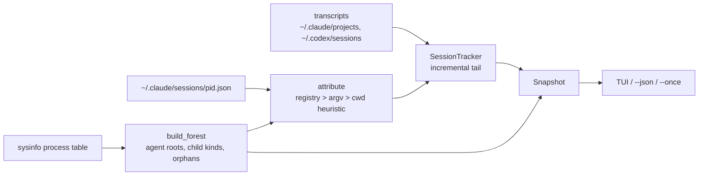

# Architecture

Two crates in one Cargo workspace.

```text
crates/agent-top-core          no terminal dependency; what --json prints
  model.rs        Agent, AgentState, TokenUsage, ToolSpan, ProcNode, Snapshot
  process.rs      sysinfo scan -> agent roots, child kinds, orphans
  harness/        one adapter per harness (claude.rs, codex.rs)
  jsonl.rs        incremental line reader with a byte offset
  pricing.rs      dated price table, longest-prefix model match
  collector.rs    joins processes + transcripts into a Snapshot

crates/agent-top               ratatui front end
  main.rs         clap flags, event loop, --once / --json, trace subcommand
  trace.rs        session lookup and the Chrome trace event writer
  app.rs          selection, sort, toggles, sparkline histories
  ui.rs           header gauges, table, detail pane (tree | trace), help
  format.rs       tokens/bytes/age/cost formatting, plain table
```

## Data flow per tick



1. **Scan.** `ProcessScanner` refreshes the process table, CPU and memory. `classify_agent` marks harness roots; `build_forest` folds children under them and labels each child `subagent`, `mcp`, `shell` or `tool`. MCP-looking processes with no agent ancestor become **orphans**.
2. **Attribute.** For each root, find its transcript. Claude Code: the registry file keyed by pid (exact), then a `--resume <id>` argument, then the transcript in the cwd's project directory created closest after process start. Codex: the newest rollout whose `session_meta.cwd` matches the process cwd, else the newest rollout started after the process.
3. **Tail.** A `SessionTracker` per transcript reads only the bytes appended since last tick (up to 8 MB per tick) and folds them into a `SessionSummary`: usage, cost, turns, tool calls, model, last activity, and whether the agent is mid-turn.
3a. **Pair.** Within that same pass, each adapter feeds a `SpanLog`: a "call started" record opens a span keyed by the harness's own call id, the matching "call finished" record closes it with the elapsed wall time. The log keeps the newest `MAX_SPANS` (128) and tolerates calls that overlap, arrive out of order, or never come back — an agent runs tools in parallel, and a session can end mid-call. This costs one extra field lookup per line and no extra I/O, because the bytes are already in hand.
3b. **Export.** `agent-top trace` does not use the live tracker. It opens the transcript again with an unbounded `SpanLog`, drains it in one go with `refresh_all`, and writes every span; the 128 cap stays where the per-tick clone makes it necessary.
4. **State.** Registry status if present, else transcript activity, else CPU and mtime.
5. **Stopped sessions.** Transcripts modified inside the window (default 30 min) that no process owns are shown as `stopped`.

## Harness formats (verified 2026-09-03)

| Harness | Transcript | Usage | State |
|---|---|---|---|
| Claude Code 2.1.259 | `~/.claude/projects/<cwd with non-alnum → '-'>/<session>.jsonl` | `message.usage` on `assistant` lines; one API message spans several lines with the same `message.id`, so usage is deduped by id; `cache_creation.ephemeral_{5m,1h}_input_tokens` split cache writes by TTL | `~/.claude/sessions/<pid>.json` `status` (`busy`, `idle`, `shell`); fallback: last `user` line → working, `assistant` with `end_turn` → waiting |
| Codex 0.149 | `~/.codex/sessions/YYYY/MM/DD/rollout-<ts>-<id>.jsonl` | `event_msg`/`token_count` → `info.total_token_usage`, cumulative; `input_tokens` includes `cached_input_tokens` | `task_started` → working, `task_complete`/`turn_aborted` → waiting |

## Pricing

USD per million tokens, Anthropic list prices cached 2026-06-24. Cache writes are 1.25x input (5-minute TTL) and 2x input (1-hour TTL); cache reads are 0.1x input, except Claude Fable 5.1 at $0.25. Any model not in the table contributes to `unpriced_tokens` and the row's cost is displayed as a floor (`≥`) or `n/a`.

## Non-goals of the current design

- No daemon, no persisted history across runs.
- No async runtime; one blocking refresh per tick is measured at a few milliseconds for a handful of agents.
- No control plane: nothing here sends a signal.
