# Architecture

Two crates in one Cargo workspace, split by dependency rather than by size.

**`agent-top-core`** is everything that does not need a terminal: process discovery, transcript parsing, pricing, the process model, and the collector that joins them into a snapshot. It is what `--json` prints, so all of it is testable without a TTY.

**`agent-top`** is the ratatui front end and the command line: the live view, `--once`, `report` and `trace`.

```text
crates/agent-top-core
  model.rs        Agent, TokenUsage, ToolSpan, ProcNode, Snapshot: the shapes --json prints
  process.rs      sysinfo scan: agent roots, child kinds, orphans
  harness/        the HarnessAdapter trait and one adapter per harness
  jsonl.rs        incremental line reader that remembers its byte offset
  pricing.rs      the dated price table, longest-prefix model match
  advice.rs       the three advice rules
  collector.rs    joins processes and transcripts into a Snapshot

crates/agent-top
  main.rs         flags, event loop, --once and --json, the subcommands
  app.rs          selection, sort, toggles, burn rate, sparkline histories
  ui.rs           header, table, detail pane, popups
  report.rs       the cross-harness cost report
  trace.rs        session lookup, Chrome trace and OTLP/JSON writers
  update.rs       the daily version check and the upgrade popup
  format.rs       tokens, bytes, age and cost formatting; the plain table
```

## What happens each tick

Once a second, the collector runs five steps and hands the front end a new snapshot.

{ .bare }

### 1. Scan the processes

`sysinfo` refreshes the process table, CPU and memory, excluding Linux worker threads: they share their process's memory and must not be counted as extra processes. Each process is classified: a harness root (`claude`, `codex`, `gemini`, `opencode`, `kodelet`), or a child of one. Children are labelled `agent`, `mcp`, `shell` or `tool` from their command line. A nested harness is still an `agent`; process ancestry does not establish a logical subagent relationship. An MCP-looking process with no agent ancestor becomes an **orphan**. Legacy snapshot process kinds named `subagent` are read as `agent`.

For Codex's npm install, the Node launcher and its native child are the same invocation, both labelled `agent`; both real PIDs contribute resources, but rollout ownership is read from the native child by matching the forwarded arguments. Explicit sandbox, execution, patch and management helpers are tools, not agents. Codex's native `spawn_agent` creates an in-process session: its actual parent is recorded in `session_meta.payload.source.subagent.thread_spawn.parent_thread_id`, or the explicit `thread_source: "subagent"` and `parent_thread_id` fields, not the OS process tree. `forked_from_id` is history ancestry and is not used as a subagent parent. These distinctions were checked against `openai/codex` tag `rust-v0.154.0` on 2026-09-17.

The collector carries that relationship, plus the optional nickname and role, in each row's `subagent` metadata. The TUI groups these rows into a session hierarchy, separate from the process tree. Token and cost figures remain per rollout; nesting does not add a child's usage to its parent again. Shared process CPU and RSS are carried by one row, preferring a main session when available. No per-subagent memory estimate is made. A child whose parent is outside the snapshot or hidden remains visible without inventing a parent row.

Kodelet v0.6.17-beta executes sessions in `serve` and `runner start`; its `run`, `chat` and `acp` processes are clients and do not become extra agent rows. Kodelet's explicit `metadata.parent_conversation_id` supplies child lineage, including code-search sessions. `conversation_fork` alone is only history ancestry. Child rows keep separate cumulative accounting and share host resources in the same way as Codex.

### 2. Attribute each root to its transcript

The collector asks the harness's adapter, and the adapter says how sure it is:

- **Claude Code**: the per-pid registry file (exact), else a `--resume <id>` argument, else the transcript in the working directory's project folder created closest after the process started.
- **Codex**: the rollout file the process holds open (exact), else the newest rollout whose recorded `cwd` matches the process, else a live rollout started after the process.
- **Gemini CLI**: the newest session in the project directory whose `.project_root` is the process cwd, started after the process.
- **OpenCode**: the newest session in its SQLite store whose directory matches the process cwd.
- **Kodelet**: active runner records matched by local host identity, live PID, connection time and heartbeat; remaining active turn receipts matched to the daemon's local connection metadata. Registry matches are reserved before fallback attribution. No socket calls or locks are acquired.

The attribution is carried into the row and shown in the detail pane, so a heuristic is never mistaken for a fact.

### 3. Tail the transcripts

One tracker per transcript reads only the bytes appended since the last tick, at most 8 MB per tick, and folds them into a running summary: usage, cost, turns, tool calls, model, last activity, and whether the agent is mid-turn.

SQLite harnesses rebuild from snapshots rather than tailing bytes. Kodelet reads cumulative usage once per conversation, not the duplicate summary table or copied provider usage. A fork resets that usage; copied tool results older than the new conversation are excluded. Tool metadata supplies completion times and, for bash/extension tools, durations. Missing inference timing and per-response usage are left unknown rather than estimated.

Three things happen in that same pass, because the bytes are already in hand:

- **Subagents.** A Claude Code session's subagents each write their own transcript under the session; Gemini CLI writes one per subagent under the chat. The tracker tails those too and folds them into the parent, because the harness bills and shows them as part of the session.
- **Spans.** A "call started" record opens a span keyed by the harness's own call id; the matching "finished" record closes it with the wall time. Inference spans open when something is submitted to the model and end at the reply; turn spans run from a prompt to the end-of-turn marker. The log keeps the newest 128 spans and tolerates calls that overlap, arrive out of order, or never return.
- **Context and MCP.** Prompt growth between responses is attributed to the tool results submitted in between, which is the context-by-source ledger; MCP calls are counted per server from the tool names or events the harness writes.

`agent-top trace` and `agent-top report` do not use the live tracker. They open a transcript again with no span cap and read it in one go, which is why they work on sessions that ended long ago.

### 4. Decide the state

Registry status if the harness publishes one, else transcript activity, else CPU and file modification time.

### 5. Add the stopped sessions

A transcript modified inside the window (30 minutes by default) that no process owns is shown as `stopped`, attributed as transcript-only.

## Harness formats

Verified 2026-09-03. Each adapter is locked with a golden fixture, a small real transcript checked in with the exact numbers it should produce, so a regression in agent-top's own parsing is caught. An upstream format change is caught differently: a session that did work while accounting for no tokens is flagged as drift, by name, rather than shown as a believable `$0.00`.

| Harness | Transcript | Usage | State |
|---|---|---|---|
| Claude Code 2.1.259 | `~/.claude/projects/<cwd with non-alnum as '-'>/<session>.jsonl` | `message.usage` on `assistant` lines, deduplicated by `message.id`; cache writes split by TTL | `~/.claude/sessions/<pid>.json` status (`busy`, `idle`, `shell`); fallback: last `user` line means working, `assistant` with `end_turn` means waiting |
| Codex 0.149 | `~/.codex/sessions/YYYY/MM/DD/rollout-<ts>-<id>.jsonl` | `token_count` events, cumulative; input includes cached input | `task_started` means working, `task_complete` or `turn_aborted` means waiting |
| Gemini CLI 0.58 | `~/.gemini/tmp/<project>/chats/session-<ts>-<id>.jsonl`, with `.project_root` beside `chats/` | `tokens` on `gemini` messages, deduplicated by message id; thoughts count as output | `user` message means working, `gemini` message means waiting |
| OpenCode | `~/.local/share/opencode/opencode.db`, read-only | token and cost columns on each message | message timestamps |
| Kodelet 0.6.17-beta | `$KODELET_BASE_PATH/storage.db`, default `~/.kodelet/storage.db`, read-only | cumulative `usage`; Responses cached input normalized; recorded USD costs | durable `runner_runs` / `chat_turns` receipts |

## Pricing

USD per million tokens, from a table compiled into the binary and overridable per model from `~/.config/agent-top/prices.toml`. Anthropic cache writes are 1.25x input for the five-minute TTL and 2x for the hour; cache reads are 0.1x input, with one exception the table carries. Gemini rows use the under-200k-token tier. A model not in the table contributes to `unpriced_tokens` and its cost is shown as a floor, never estimated. Details in [Prices](prices.md) and [Accounting](accounting.md).

## Non-goals of the current design

- No daemon and no persisted history across runs. The report reads the transcripts each time.
- No async runtime. One blocking refresh per tick is measured in a few milliseconds for a handful of agents.
- No control plane. Nothing here sends a signal to a process.
