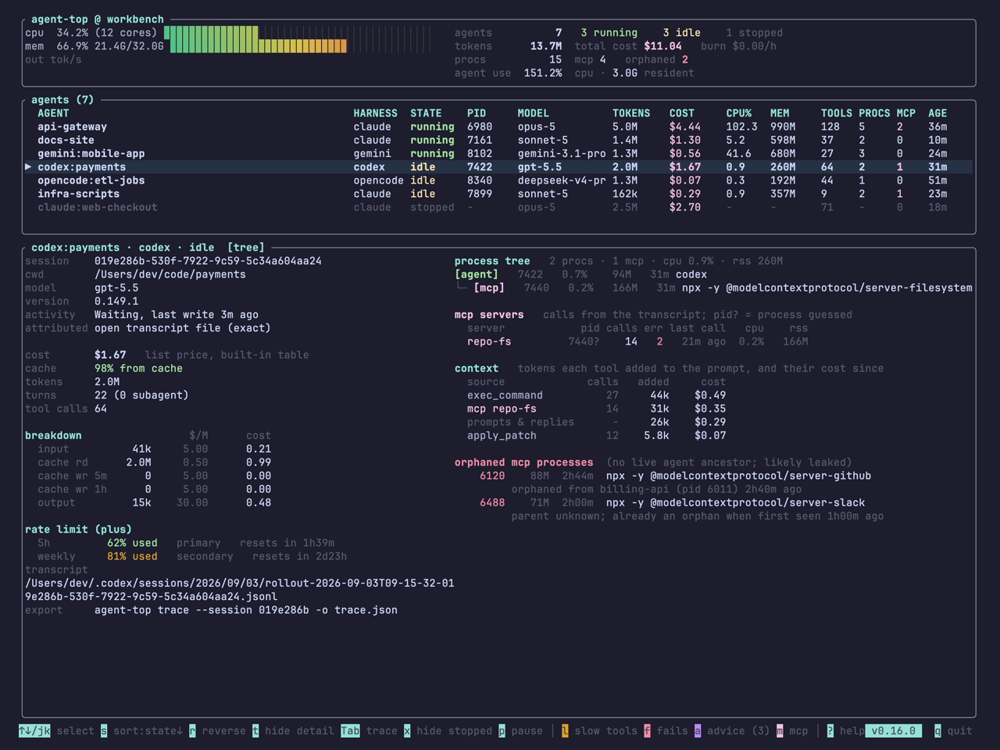

# Codex rate limits, read from the rollout file

On a ChatGPT plan, Codex has a usage allowance measured over a rolling five-hour window, and a weekly one on top. Codex's `/status` command shows how much is left, in the session you type it into.

Codex also writes the same numbers into every session's rollout file, after every model response. agent-top reads them from there and shows them next to the session's tokens and cost.

<!-- more -->

## What the plan limits are

OpenAI's [Codex pricing page](https://developers.openai.com/codex/pricing) describes the allowance this way, as of today:

- Limits are given as estimated **local messages per five-hour period**, as a range per model and plan. The page says these are estimates, not fixed message limits.
- **Weekly limits may also apply.**
- **Local messages and cloud chats share one allowance.** Cloud chats may use more of it than local messages.
- If you hit the limit **during a turn, that turn is allowed to finish**, subject to fair use.
- After the limit, Plus and Pro users can buy credits, Business, Edu and Enterprise plans with flexible pricing can buy workspace credits, and anyone can keep going with an API key at API rates.
- Current usage is on the [usage dashboard](https://chatgpt.com/codex/settings/usage), and `/status` shows it inside a CLI session.

The ranges per model change often, so this post does not copy them. The page has the current table.

## Where Codex writes it down

Codex records each session as JSONL under `~/.codex/sessions`. After each model response it writes a `token_count` event with the token usage and a `rate_limits` snapshot:

```json
{"timestamp":"2026-09-24T10:00:00.000Z","type":"event_msg","payload":{
  "type":"token_count",
  "info":{"total_token_usage":{"input_tokens":41000,"output_tokens":15000}},
  "rate_limits":{
    "limit_id":"codex",
    "primary":  {"used_percent":62.0,"window_minutes":300,  "resets_at":1790000000},
    "secondary":{"used_percent":81.0,"window_minutes":10080,"resets_at":1790500000},
    "plan_type":"plus",
    "rate_limit_reached_type":null}}}
```

| Field | Meaning |
|---|---|
| `primary`, `secondary` | two rolling windows; usually the 5-hour one (`300` minutes) and the weekly one (`10080`) |
| `used_percent` | how much of that window is used |
| `resets_at` | when the window resets, in Unix seconds |
| `plan_type` | the ChatGPT plan: `plus`, `pro`, `business` and others |
| `rate_limit_reached_type` | set when a limit has been hit, `null` otherwise |
| `limit_id` | which quota this snapshot describes; `codex` for the main one |

The numbers come from OpenAI's servers. Codex reads them from `x-codex-primary-used-percent`, `x-codex-primary-window-minutes`, `x-codex-primary-reset-at` and the matching `secondary` headers on each response (`codex-rs/codex-api/src/rate_limits.rs`), and writes what it got. Each snapshot is the server's figure at the moment of that response.

The snapshot also carries `limit_name`, `credits`, `individual_limit` (an enterprise monthly credit cap) and `spend_control_reached`. agent-top reads the windows, the plan and whether the limit is reached.

## What agent-top shows

The detail pane of a Codex row has a `rate limit` section: the plan, then one line per window with how much is used and when it resets.



The window is labelled by its length (`5h`, `weekly`), and its slot (`primary`, `secondary`) is shown after it in grey. The colour changes at 75% (amber) and 90% (red). A hit limit adds `LIMIT REACHED` to the heading.

`agent-top --once` lists every live or idle session at 75% or more of either window in a `RATE LIMITS` section:

```text
RATE LIMITS (near or at limit)
  codex:payments            81% of its weekly window
```

Stopped sessions are left out of that list. Their last snapshot is from when they last ran, and the window has probably reset since. The detail pane still shows it for any session you select.

## The limit belongs to the account

The allowance is per ChatGPT account, and every Codex session on it reports the same limit. Each row shows the account's usage as of that session's last response. With three Codex sessions open, the one that responded most recently has the current figure. An idle session from this morning shows this morning's.

## Two things the data showed

**The windows are not fixed.** On the Plus account agent-top is developed on, most snapshots from July and August 2026 have one window, the weekly one, in the `primary` slot, with no 5-hour window. September's have both again. The pricing page's "weekly limits may also apply" allows for either shape. agent-top labels each window by its length, so a weekly window in the `primary` slot still reads `weekly`.

**A second quota can blank the first.** Codex sometimes writes a snapshot for another quota, `limit_id: "premium"`, with both windows `null`. agent-top took the latest snapshot as the current state and read a `null` window as one at 0%. A session whose last snapshot was a `premium` one therefore showed 0% used. In 7 of the 124 Codex sessions on the development machine, the last snapshot is one of these.

The golden fixture for Codex 0.154 had recorded the wrong reading. That session ended at 91% of its 5-hour window and 100% of its weekly one, and the expected output said 0% and 0%. [#55](https://github.com/kannandreams/agent-top/pull/55) fixes it in v0.21.1: a `null` window is missing, and a snapshot with no windows leaves the last one in place. On v0.21.0 or earlier, a Codex row showing 0% for both windows is probably this bug. The fixture now expects 91% and 100%.

## What agent-top does not show

A session signed in with an API key has no plan allowance and is billed per token. agent-top shows a rate limit only where the rollout has one. Codex is the only harness agent-top reads a rate limit from, so Claude Code, Gemini CLI, OpenCode and Kodelet rows have no `rate limit` section.

The credit balance and the enterprise monthly cap are in the snapshot but not on screen yet.

## Try it

```sh
brew install kannandreams/tap/agent-top   # or: cargo binstall agent-top
agent-top
```

Select a Codex row and read the `rate limit` section, or run `agent-top --once` for any session near its limit. The [live view](../../live-view.md) page has the rest of the detail pane.
