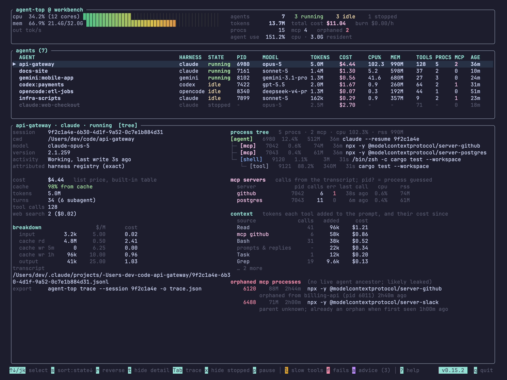
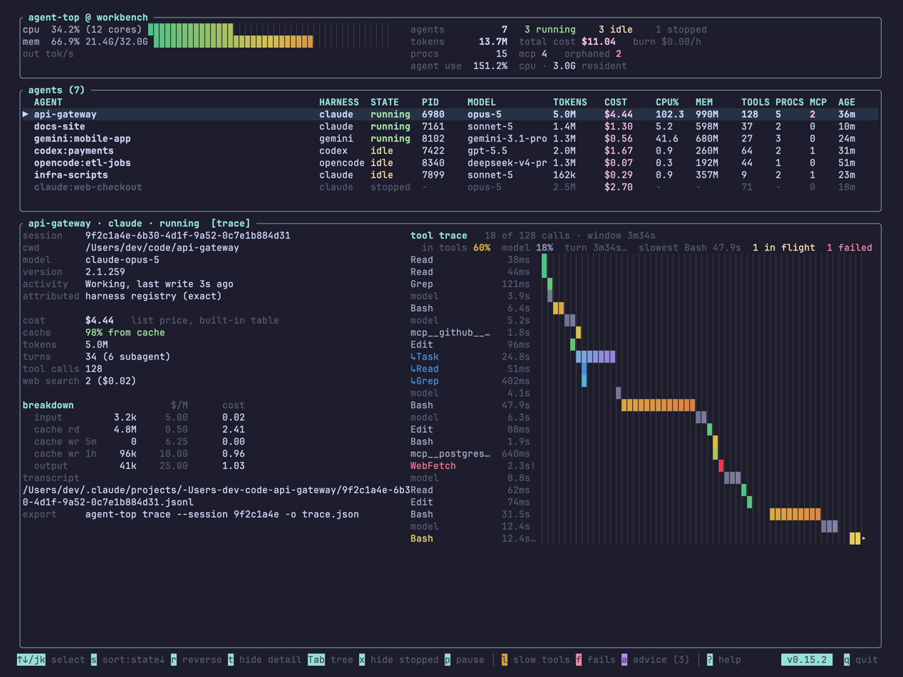

# Five things agent-top shows that your agents will not

You have two Claude Code sessions open, a Codex thread inside the editor, and a Gemini CLI you started this morning and forgot about. Each one has a window. None of them has the whole picture. Which one is burning tokens right now? Which one is waiting for you? Which MCP server is still alive after the agent that started it went away?

agent-top is the whole picture, in one terminal. This post is the five parts of it I would show someone first: the problem each one answers, and what it looks like.

<!-- more -->

A word on the pictures. Every screenshot of the live view below is a synthetic snapshot replayed through agent-top, not my machine. A screenshot of real sessions would publish real project names, paths and session ids. The two report screenshots are real, because a cost total gives nothing away. How that replay works is item five.

## 1. Every agent on the machine, in one table

**The problem.** Coding agents have become long-running processes, and you keep several at once. `htop` shows you a `node` process with no idea whose it is or what it is spending. Each harness shows its own session and nothing about the others. So you tab between windows and add things up in your head.

**What agent-top shows.** One row per session, whichever tool started it. Claude Code, Codex, Gemini CLI and OpenCode sit in the same table with the same columns: state, model, tokens, cost, CPU, memory, tool calls, how many processes it owns and how many of those are MCP servers.



The two columns to read first are STATE and COST. `running` is an agent mid-turn. `idle` is an agent waiting for you, which is the one you have probably forgotten about. `stopped` is a recent transcript with no process behind it. The cost is counted from the harness's own usage records and priced at list price, not estimated from characters. Subagents are folded into their parent so a session that fans out does not show up as five rows.

Select a row and the detail pane below fills in: the session id, the working directory, how the process was matched to its transcript and whether that match was exact or a guess, the cache hit rate, and a breakdown of the cost by token class.

## 2. The MCP server that outlived its agent

**The problem.** This is the bug that made me write the tool. A harness starts an MCP server for a session. The session ends, or a subagent finishes, and the server is never told. It sits there holding memory. Do that a few hundred times and the machine starts to swap. Codex has a run of open reports about exactly this, and nothing about it is specific to Codex; every harness that spawns helper processes can leak them.

**What agent-top shows.** The process tree under each agent, with MCP servers marked. And below it, in red, any MCP server on the machine that has no live agent above it, with the agent it was orphaned from and how long ago.


In the picture there are two. One was under an agent called `billing-api`, which went away two hours and forty minutes ago. The other was already an orphan when agent-top first saw it, so its parent is unknown. Both are still holding memory. agent-top will not kill them; it never signals a process. It tells you the pid, and the `kill` is yours.

There is an earlier warning too. Press `a` and the advice panel names a server whose memory has been climbing with no calls to explain it, which is the shape of a leak before it becomes an orphan.

## 3. Which tool is filling the prompt, and what that costs

**The problem.** Every response an agent gets re-reads the whole conversation. So a tool result is not paid for once. A `Read` that returned forty thousand tokens is billed again on every response for the rest of the session, until the context is compacted. A chatty MCP server can quietly become the biggest line in the bill. No harness shows this. You see the total climb and you do not know why.

**What agent-top shows.** A `context` section in the detail pane, one row per source, largest first: each built-in tool by name, each MCP server, and one row for the prompts and replies themselves. For each, the calls, the tokens those results added to the prompt, and what re-reading them since has cost. The rows add up to the session's prompt-side cost, so you can check them against the breakdown above.

Look again at the first screenshot. In that session `Read` has added 96k tokens to the prompt and cost $1.21 in re-reads. The `github` MCP server added 58k in six calls, so nearly ten thousand tokens a call, for $0.86.

That second one is the kind of thing the advice panel is for:


Three rules, applied to the numbers already on screen. A source whose results are large per call and have added a lot to the prompt. An MCP server attached to a live agent that has not been called in ten minutes, whose tool definitions are still sent with every response. A server whose memory is growing while unused. Each comes with one sentence of what you could do. Nothing is done for you.

The numbers are computed from the usage records alone: how much bigger the next prompt was after each tool result. No tool output is ever read.

## 4. What all of it cost, by harness or by day

**The problem.** The live view is one moment. The question that actually comes up is "what has all of this cost me", and the answer is spread across four tools with four billing pages, none of which counts the others.

**What agent-top shows.** `agent-top report` reads the transcripts already on disk and adds them up, priced the same way, over a window you choose. Grouped by harness:

```sh
agent-top report --since all --by harness
```


This one is real, from the machine agent-top is developed on. Three harnesses, one total. The CACHE column is the share of the prompt served from cache, which is the biggest lever on cost you are not looking at. The `+` on the Codex row is honest accounting: some tokens ran on a model with no price in the table, so the figure is a floor. It is never rounded down into a believable small number.

Grouped by day it becomes a spend timeline:

```sh
agent-top report --since 14d --by day
```


`--by model` says which model the money went to and `--by project` which repository. `--json` gives you the same rows for a script. Nothing is written and nothing leaves the machine.

## 5. Replay: the whole screen in one file

**The problem.** Someone reports a wrong number. You ask what they saw. They describe it. You cannot reproduce it, because their machine is not yours.

**What agent-top shows.** Everything on screen comes from one data structure. `--json` prints it, and `--replay` renders it back, with every key working, without reading anything on the local machine.

```sh
agent-top --json > snap.json       # what agent-top sees right now
agent-top --replay snap.json       # the same screen, anywhere, later
```

Attach the file to a bug report and the reader can select rows, open the trace and read the process tree exactly as you saw them. That is a far better bug report than a paragraph.

It is also how this post was made. Every live-view picture above is a replay of one synthetic snapshot that lives in the repository. You can replay it yourself:

```sh
curl -LO https://raw.githubusercontent.com/kannandreams/agent-top/main/docs/demo-snapshot.json
agent-top --replay demo-snapshot.json
```

Press `Tab` on the first row and you get the tool trace for that session, which is the last thing I want to show:



One row per tool call and model response, on a shared time axis, newest at the bottom. A single long call and a storm of short ones look different at a glance. The header says where the time went: how much to tools, how much to the model, what is in flight and what failed. The same data leaves the terminal with `agent-top trace`, as a file Perfetto opens or as OpenTelemetry for Jaeger and Tempo, reconstructed from the transcript without any telemetry switched on in the harness.

## What it will not do

agent-top observes. It does not kill or restart a process, write to a transcript, or send your data anywhere. It reads the files the harnesses already write and the process table the OS already keeps, metadata only, never prompt text or tool output. The one network call it makes on its own is a daily version check, which sends nothing about you and which `AGENT_TOP_NO_UPDATE_CHECK=1` turns off.

## Try it

```sh
brew install kannandreams/tap/agent-top   # or: cargo binstall agent-top
agent-top
```

One static binary, nothing to configure. Start it while your agents are running. The [docs](../../index.md) cover the rest, and the [roadmap](../../roadmap.md) says what is next.
