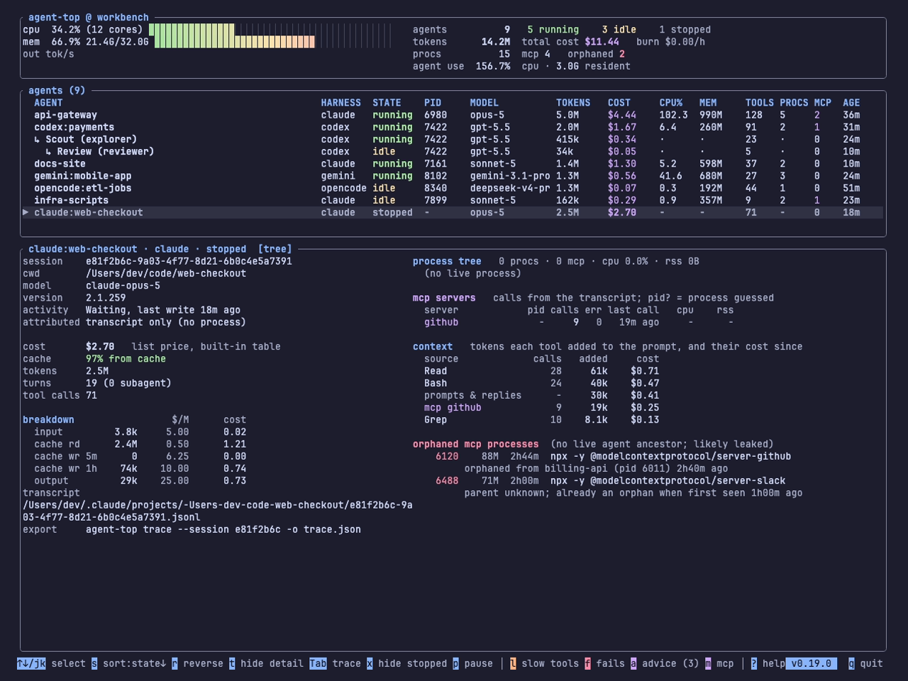
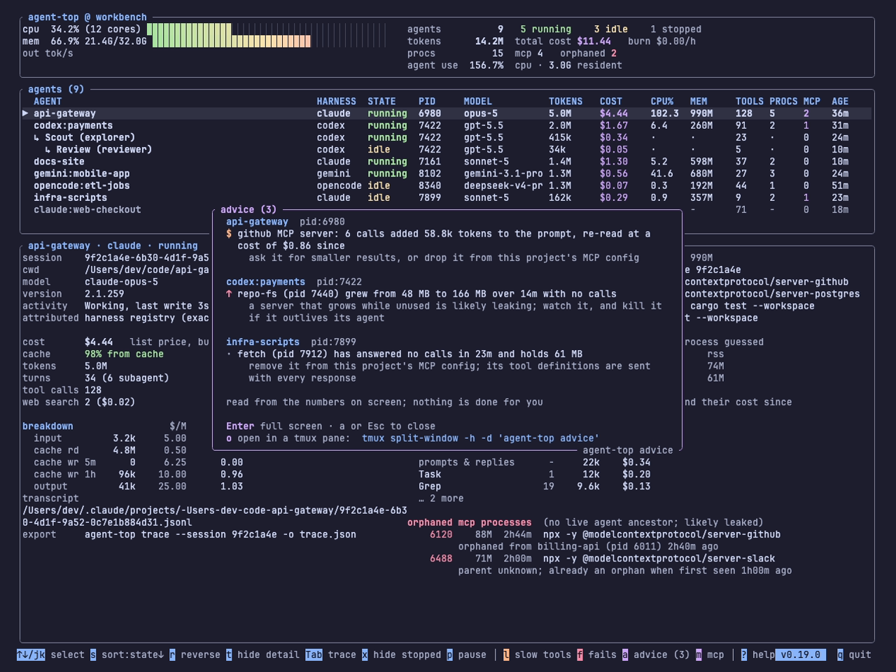

# The MCP server that outlives its agent

Run a few coding agents for a week and then look at your process list. Somewhere in it, if you are unlucky, is a `node` or `python` process that nobody asked for, parented to pid 1, holding eighty megabytes, doing nothing. It was an MCP server. The agent that started it finished hours ago.

This post is about how that happens, why it is worth catching early, and how agent-top shows it.

<!-- more -->

## How a server is supposed to end

When a harness starts a Model Context Protocol server over stdio, it launches a child process and talks to it through pipes. The arrangement is simple and it usually ends cleanly: the agent exits, the pipes close, the server reads end-of-file on its input and exits too. Nothing else is needed. That is the design working as intended, and most of the time it is what you get.

There are two ways it goes wrong.

The first is on the harness side. A session ends, or a subagent finishes, and the harness does not close the server's pipes or reap the child. The server is still connected to something, so it waits. If the harness spawned one server per subagent, it waits many times over.

The second is on the server side. The pipes do close, but the server was not written to notice. It ignores end-of-file and keeps its event loop running, with nothing left to listen to. Servers assembled quickly from a template do this more often than you would hope.

Either way the result is the same: a process with no agent above it, alive for as long as the machine is.

## This is a real bug, not a thought experiment

Codex has carried a run of reports about exactly this shape of leak. Several are still open.

| Report | State | What it describes |
|---|---|---|
| [#12491](https://github.com/openai/codex/issues/12491) | open | MCP children not reaped after a task completes: 1300+ zombies, 37 GB leaked |
| [#17574](https://github.com/openai/codex/issues/17574) | open | Subagents leak stdio MCP helper trees, which accumulate indefinitely |
| [#25015](https://github.com/openai/codex/issues/25015) | open | The app-server leaks a process stack per subagent, so memory grows linearly |
| [#16256](https://github.com/openai/codex/issues/16256) | closed | MCP subagent processes never terminated when a session is stopped or suspended |
| [#19753](https://github.com/openai/codex/pull/19753) | merged Apr 2026 | The fix for one of those paths: terminate stdio MCP servers on shutdown |

I cite Codex because its tracker is public and the reports are specific, not because Codex is unusual. Every harness that spawns helper processes has the same bug available to it, and every MCP server that ignores end-of-file leaks under every harness. The interesting property is that the symptom is the same regardless of whose bug it is: a server process with no live agent ancestor.

## Why it is worth a red row

One leaked server is a nuisance. The trouble is that you never leak one. You leak one per session, or one per subagent, and the sessions keep coming. Memory pressure creeps up over days, the machine starts to swap, and the first sign is that everything feels slow. By then the process list is full of identical `npx` invocations and it is not obvious which of them still belong to something.

Catching it early means catching it while the agent that started the server is still on the screen, or has only just gone.

## What agent-top shows

agent-top does not know about any vendor's bug. It walks the process tree and asks one question of every MCP-looking process: is there a live coding agent above it? If not, the process is listed in the detail pane under **orphaned mcp processes**, in red, with its pid, memory, age, and the agent it was orphaned from and how long ago. If agent-top only started watching after the leak, the line says so: the parent is unknown, and here is how long it has been an orphan on agent-top's watch.

There is an earlier signal, before the agent goes. The advice panel (`a`) names an MCP server that is attached to a live agent but has answered no calls in a while and whose memory has been climbing steadily. Memory that grows while nothing is using it is the shape of a leak before it becomes an orphan.

The counts in the header keep score: `mcp 4  orphaned 2` is the whole machine's state in five words.

## What to do about one

Kill it. agent-top will not, on purpose: it never signals a process, so it can be left running without a second thought. It gives you the pid and the command line, and the rest is a `kill`.

If the same server keeps turning up, the fix belongs upstream. For a harness-side leak, the issue tracker for that harness, with the pid and parent from agent-top as evidence. For a server that ignores end-of-file, the server's own repository; the fix is usually a few lines that exit when stdin closes.

Until then, a glance at the red rows once a day is enough to keep the machine honest.
