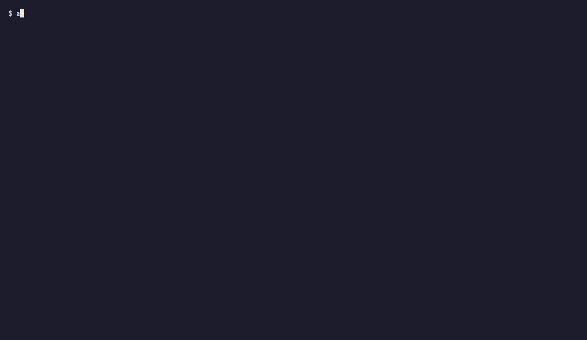

# agent-top

<p class="at-lead">agent-top is a terminal dashboard for the coding agents running on your machine. It reads the transcripts the harnesses already write and the process table the OS already keeps, then shows every Claude Code, Codex, Gemini CLI and OpenCode session, and any other coding harness it can see, in one place: what each one is doing, how many tokens and dollars it has spent, and which helper processes it has left behind.</p>

```sh
brew install kannandreams/tap/agent-top   # or: cargo binstall agent-top
agent-top
```

{ .bare }

Coding agents have become long-running processes, and you tend to keep several at once, each in its own window with its own cost and its own leaks. No single harness shows them together. agent-top does, the way `htop` does it for processes and `btop` for the whole machine.

It is written in Rust and ships as one static binary for macOS and Linux: no runtime, no daemon, nothing to configure and nothing to enable in your agents. It reads the transcripts the harnesses already write and the process table the OS already keeps. It never writes to, signals or kills an agent, and your data never leaves the machine.

## What to look at first

- **STATE** tells you who is working and who is waiting for you.
- **COST** is what each session has spent so far, at list price, counted from the harness's own usage records.
- **Red rows in the detail pane** are MCP servers whose agent has gone: a leak, and one agent-top watches for on every tick.

## Where to go next

- [Getting started](getting-started.md): install, first run, the keys.
- [The live view](live-view.md): every panel, what it answers, and where its numbers come from.
- [Cost report](report.md): what all of it has cost, by harness, model, project or day.
- [Snapshots and replay](replay.md): one JSON file, the whole screen, for bug reports and screenshots.
- [The blog](blog/index.md): the five features to show someone first, with pictures.
