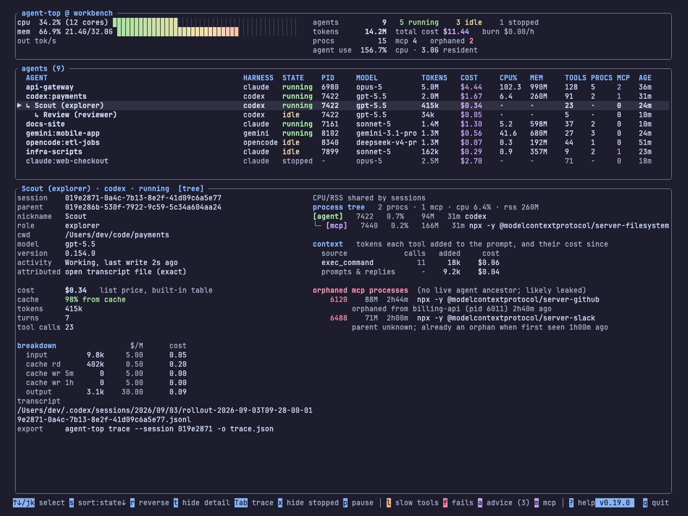
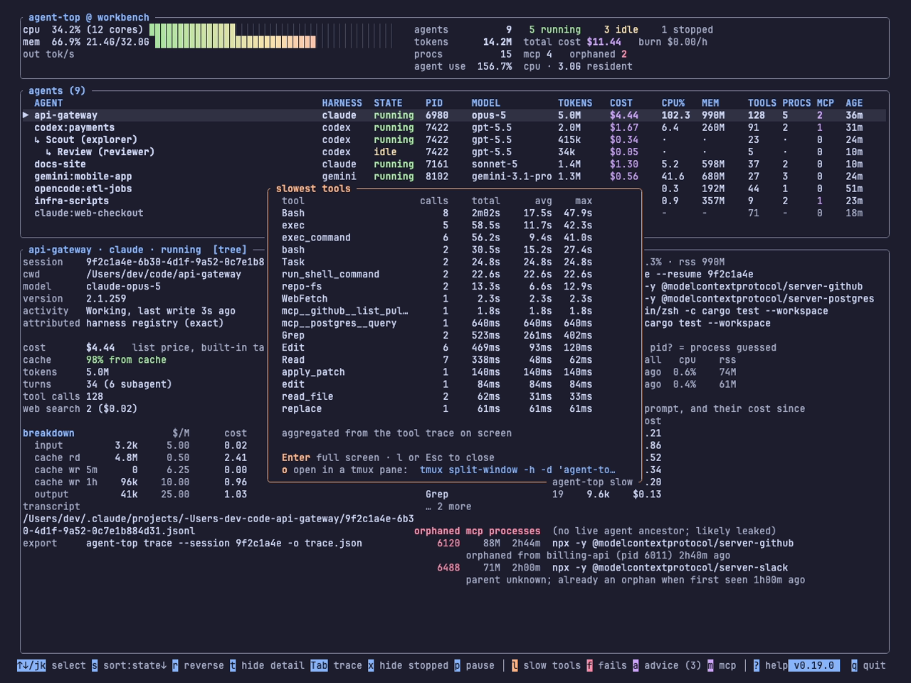
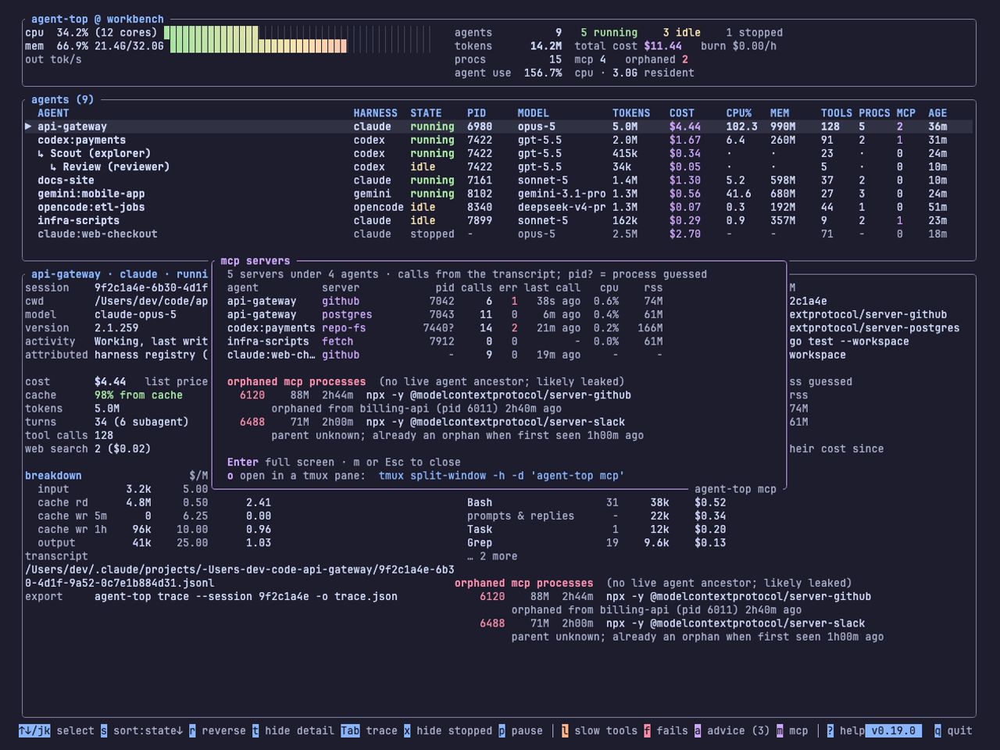
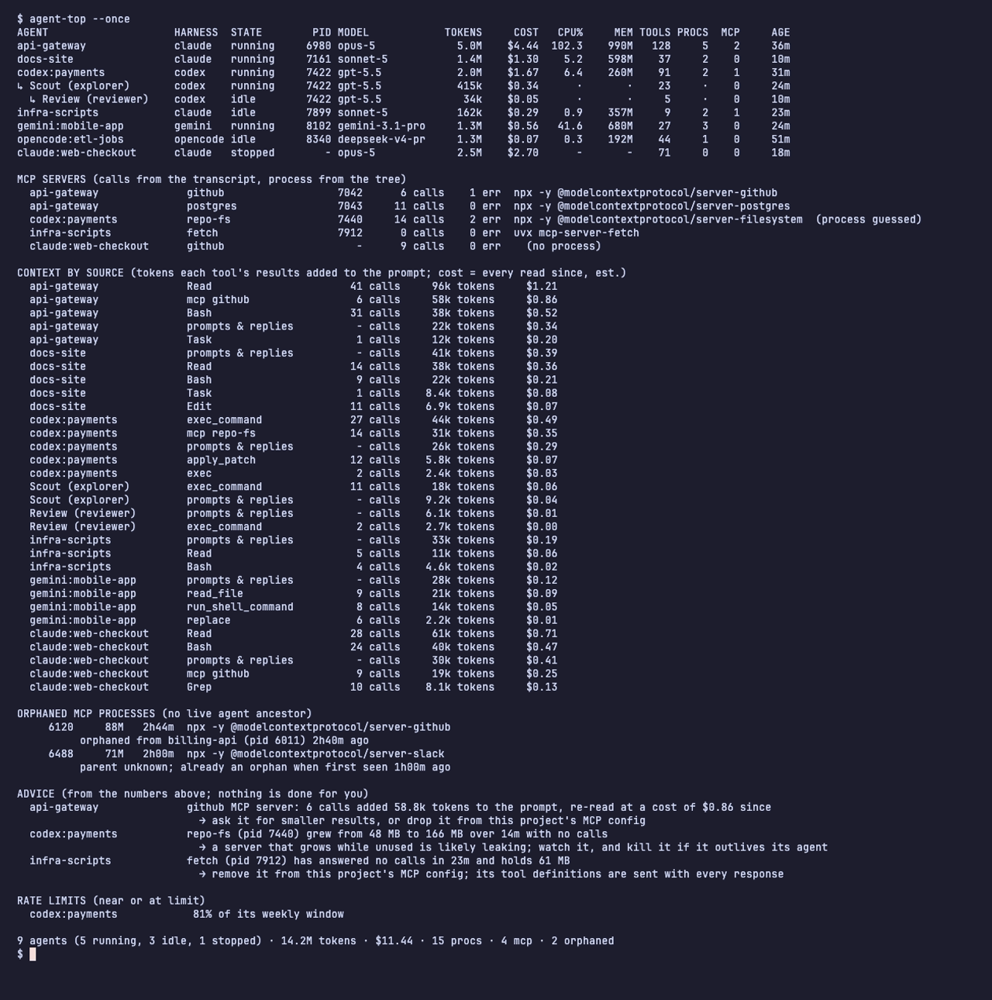

# The live view

The screen has three parts: a header for the machine, a table with one row per agent, and a detail pane for the selected row. Everything refreshes once a second. All of the pictures on this page come from a synthetic snapshot replayed with `--replay`, so the names and paths are made up; see [Snapshots and replay](replay.md).

## The header

The left side is the host: CPU and memory meters and a sparkline of output tokens per second across every agent. The right side is the totals: how many agents are running, idle and stopped; the tokens and cost across all of them; the process and MCP server counts with the orphaned count in red; and the CPU and memory the agents themselves are using, as opposed to the whole machine.

**Burn** is the spend velocity: dollars per hour, measured over the last minute across every agent at once. It answers "how fast am I spending right now", which the running total cannot, and it catches a runaway loop early. It goes dim, green, amber and red as it rises.

## The table

One row per agent, or per conversation for a harness that hosts several in one process.

| Column | What it is |
|---|---|
| AGENT | the project name, taken from the working directory; subagents are folded into their parent |
| HARNESS | claude, codex, gemini, opencode or kodelet |
| STATE | `running` (mid-turn), `idle` (alive, waiting for you) or `stopped` (a recent transcript with no process) |
| PID | the agent process |
| MODEL | the model of the latest turn |
| TOKENS | input, cached and output tokens, counted from the transcript |
| COST | what the session has spent, at list price, with a `+` when some tokens ran on a model with no price |
| CPU%, MEM | the agent's whole process tree, MCP servers included |
| TOOLS | tool calls this session, including failures; `≥` marks a lower bound from retained/observed history |
| PROCS, MCP | processes in the tree, and how many are MCP servers |
| AGE | since the process started, or since the transcript began |

`s` cycles the sort column and `r` reverses it. Codex and Kodelet subagents with explicit parent-session metadata stay nested beneath their parent; sorting applies to roots and siblings, and each row remains selectable. Stopped sessions stay visible for 30 minutes after their last write (`--stopped-window-min` changes that); `x` hides them. If a parent is hidden or outside the snapshot, its visible children remain listed.

## The detail pane

The left column is the facts about the selected session: its id, working directory, model and harness version; how it was attributed to its process, and whether that was exact or a heuristic; then the headline numbers.

- **cost**, and which price table produced it.
- **cache**: the share of the prompt served from cache, green when high and red when low. Every turn re-sends the conversation, and most of it can be billed at the cheap cache-read rate instead of full input price. A session at full price most turns is money left on the table.
- **tokens**, **turns** (with folded subagent turns for harnesses that provide them) and **tool calls**. Codex and Kodelet rows retain their own usage rather than folding child sessions into the parent. Kodelet counts durable user-turn receipts when available; legacy non-fork records fall back to assistant messages.
- **breakdown**: each token class, the rate it was charged at, and what that came to.
- **rate limit**, for harnesses that write one. Codex records a short window and a weekly one; each is shown with its use and its reset time, and a hit limit says so.
- **export**: the exact `agent-top trace` command for this session.

The right column has two views. `Tab` switches between them.

### The process tree

A Codex subagent is a session inside its parent's process, so the table above shows that hierarchy and this pane shows the process. Selecting a subagent row shows its own facts and trace, with its parent, nickname and role in the facts on the left, and the process tree of the row that owns the shared process.

The **process tree** shows the agent's process and everything under it: MCP servers, shells, the test run it started, and any nested agent processes. Each line has its pid, CPU, memory and age. Nested harness processes are labelled `[agent]`, not assumed to be subagents. Linux worker threads are excluded. Sessions sharing a process show the same process tree under a `CPU/RSS shared by sessions` note, with its resources counted once, not once per session.

Below it, **mcp servers** lists one row per server with its pid, calls, errors and last call. Calls are counted from the transcript; the process is matched to the server by name, or by elimination when one process and one server are left, in which case the pid carries a `?`. A server the transcript calls but no process owns is shown with no pid: an HTTP server, or one that has exited.

**context** is what each tool's results added to the prompt, and what re-reading them has cost since. See [Context by source](accounting.md#context-by-source) for the method.

**orphaned mcp processes** are servers with no live agent above them, a leak agent-top watches for on every tick (the story is in [The MCP server that outlives its agent](blog/posts/the-server-that-outlives-its-agent.md)). Each says which agent it was orphaned from and when, or that it was already an orphan when agent-top first saw it.

### The tool trace

A waterfall of the session's recent tool calls and model responses on a shared time axis, newest at the bottom. A single long call and a storm of short ones look different at a glance. The header line says how much of the window went to tools and how much to the model, the slowest call, what is in flight and what failed. Subagent calls are marked with an arrow, failed calls in red.

The same data leaves the terminal as a file with `agent-top trace`; see [Tool trace and export](trace.md).

## The popups

Four keys open a panel over the table. The same key, or `Esc`, closes it. `Enter` on a popup fills the terminal with it, each panel has a command of its own such as `agent-top mcp`, and inside tmux, zellij, WezTerm or kitty `o` opens it in a new pane. [Views and panes](views-and-panes.md) covers those.

**`a` advice** is the meter read for you: one sentence per thing that looks like a bad deal on the machine right now, the numbers behind it, and what you could do. Three rules, applied only to live agents and only to figures already on screen:

- an **expensive source**: a tool or MCP server whose results run to 8k tokens or more per call and have added at least 40k tokens to the prompt, so every response since has paid to re-read them;
- an **idle MCP server**: attached to a live agent, no calls in ten minutes or more;
- a **growing MCP server**: memory up at least 64 MB and half again over ten minutes or more, still climbing, with no calls in the window. That is the shape of a leak before it becomes an orphan.

Nothing is done for you. agent-top never signals a process or edits a config; it points.

**`l` slowest tools** ranks every tool by the time it took, across every agent: calls, total, average, max. **`f` failed tool calls** ranks them by how often they failed.

**`m` MCP servers** is the machine's list rather than one agent's: every server under every agent with its pid, calls, errors and last call, then the orphaned processes and where each came from.

## The plain-text view

`agent-top --once` prints the same information once and exits: the table, then sections for MCP servers, context by source, orphans, advice and rate limits. It is for a quick look, a cron job, or pasting into an issue.

