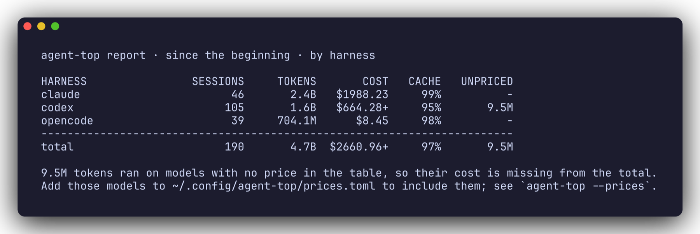
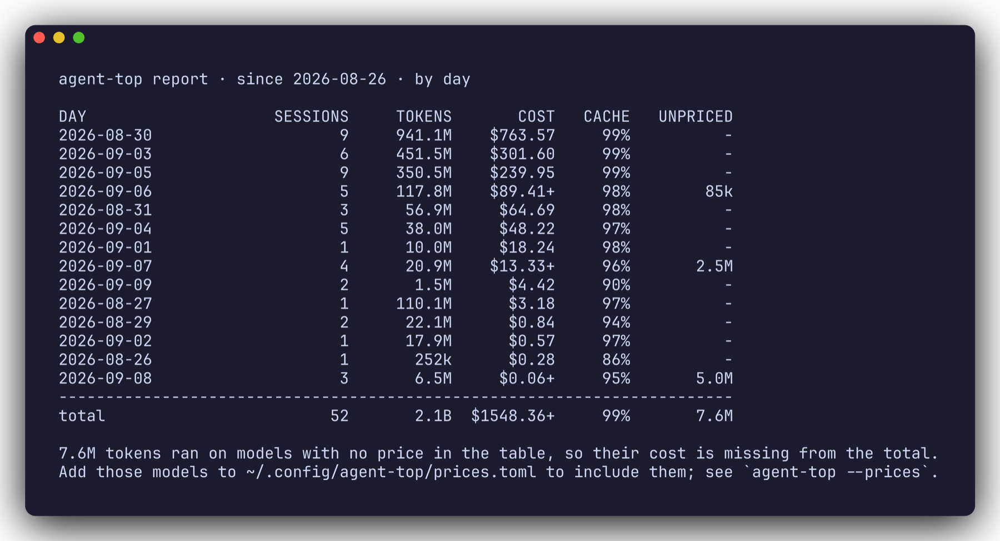
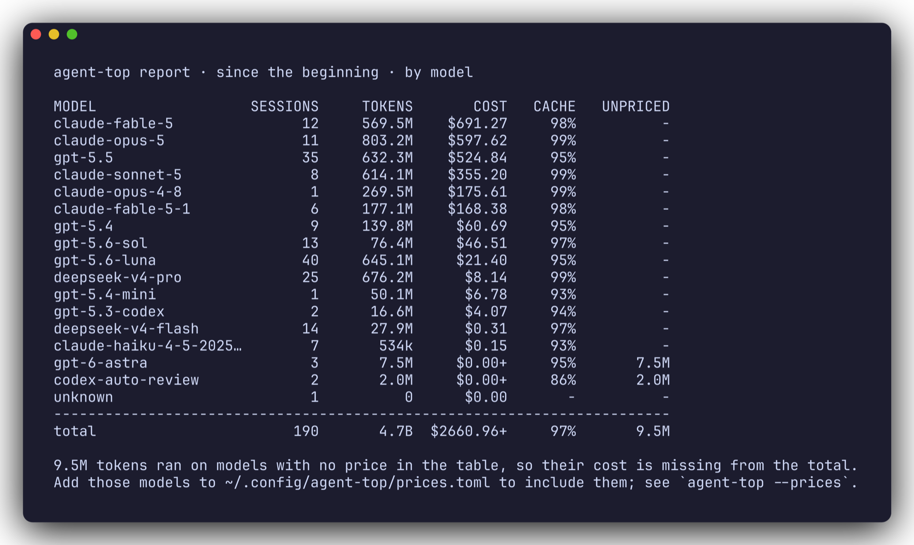

# Cost report

The live table is one moment. `agent-top report` reads the transcripts already on disk and totals cost and tokens over a window you choose, grouped by harness, model, project or day. It is the one place that adds Claude, Codex, Gemini and OpenCode into a single figure, priced the same way, so "what has all of this cost me, together" has an answer.

Nothing is written and nothing leaves the machine. It reads the same files the live view does, and a file outside the window is skipped by its modification time without being parsed.

```sh
agent-top report                          # the last 30 days, by harness
agent-top report --since 7d               # the last week
agent-top report --since all              # everything on disk
agent-top report --since 2026-09-01       # since a date
agent-top report --by day                 # a spend timeline
agent-top report --by model               # which model cost the most
agent-top report --by project             # which repository cost the most
agent-top report --json                   # the same, structured
```

## By harness

The report below is real, from the machine agent-top is developed on. A cost total gives nothing away, which is why it can be shown where a live screenshot cannot.



Each column:

- **SESSIONS** and **TOKENS** are counted from the transcripts.
- **COST** is at list price from the [price table](prices.md). A `+` means some tokens ran on a model with no price, so the figure is a floor, never an estimate.
- **CACHE** is the share of the prompt served from cache. High is efficient. A low number on a long-running model is money left on the table.
- **UNPRICED** is how many tokens the `+` stands for. The footer says what to do about it.

## By day

`--by day` is a spend timeline: one row per calendar day of last activity, most expensive first.



## By model

`--by model` answers which model the money went to. A model with no price shows `$0.00+` and its tokens under UNPRICED rather than a believable small number.



## By project

`--by project` groups by working directory, shown as its last two path components, and turns the report into a rough cost-per-repository view. It is not pictured here because it names real repositories.

## Reconciling with your harness

agent-top and your harness can disagree on a session's cost. Usually the reason is a different price table, a different cache assumption, or a subagent counted in one place and not the other. The worked example in [Where the numbers come from](accounting.md#if-the-cost-does-not-match-your-harness) walks through how to line them up.
