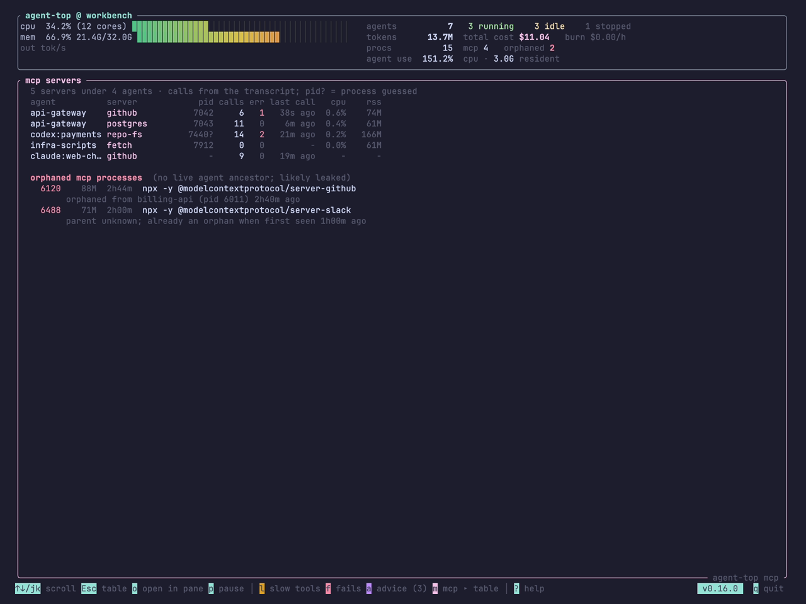

# Views and panes

The live view stacks a header, the agents table and a detail pane in one terminal. The analytics panels, slowest tools, failed tool calls, advice and MCP servers, do not have to share that space. Each panel has one key, and that key means the same thing wherever the panel is shown. What changes is how much of the terminal it gets.

| Size | How | When |
|---|---|---|
| a popup over the table | press the panel's key | a five-second question while watching the table |
| the whole terminal | `Enter` on the popup | a long list, or a while spent on one panel |
| its own terminal | `agent-top mcp` and the other commands below | a second window or a pane you split yourself |
| its own pane, split for you | `o` on the popup, inside a multiplexer | the same, without typing the command |

The keys are `l` slowest tools, `f` failed tool calls, `a` advice and `m` MCP servers. Every panel is built from the snapshot already on screen, so a panel in another pane shows the same numbers as the table it sits beside, refreshed on the same interval.

## The popup

Pressing a panel's key opens it centred over the table. The table stays visible around it, which is the point: a leaderboard means more next to the rows it was aggregated from. The same key or `Esc` closes it. Rows are capped to the popup's height, with a count of how many more there are.

The popup's last lines are the ways on from it. `Enter` fills the terminal. `o`, when agent-top is running inside a multiplexer, opens the panel in a new pane, and the line shows the command that would run.


## The whole terminal

`Enter` on a popup replaces the table and the detail pane with the panel. The header and the footer stay, so the burn rate is still in view. Every row is shown; `j` `k`, the arrows, `PageUp` `PageDown`, `g` and `G` scroll. `Esc`, or the panel's own key, goes back to the table. The other panels' keys still open popups, over the panel this time.

The frame's bottom right corner names the command that starts agent-top on this panel alone, which is how the next size is learnt.



## A dedicated command

```sh
agent-top slow      # slowest tools
agent-top fails     # failed tool calls
agent-top advice    # advice
agent-top mcp       # MCP servers under every agent, and the orphans
```

Each starts agent-top already filling the terminal with that panel. It is the same program with the same keys: popups open over it, `p` pauses, `?` is help, `q` quits. There is no table to go back to, so `Esc` with nothing open does nothing. The upgrade question is not asked in a dedicated view; it is left to the main one, so two agent-top windows do not ask it twice. The footer badge still shows a newer version.

The flags go before the command, as they do for `report` and `trace`:

```sh
agent-top --interval-ms 2000 mcp
agent-top --replay snap.json advice
```

A dedicated view runs its own collector. Two agent-top processes scan the machine twice; the scan is a process list and a read of the transcripts' tails, which is cheap enough that a pane or two is not felt.

## A pane in your multiplexer

Inside tmux, zellij, WezTerm or kitty, a popup offers `o`. It splits a pane to the right of the current one and starts the dedicated command for that panel in it, with the same flags as this run. The popup closes, because the pane now shows it, and the table comes back. Pressed on a panel that fills the terminal, `o` does the same and returns to the table.

The pane is an ordinary agent-top. `q` in it quits, and the multiplexer closes the pane, so nothing is left behind.

!!! info "What `o` runs"

    The multiplexer is recognised from the variable each one sets in its shells. The command is the one in the table, with `agent-top` being the path of the binary that is running and `<flags>` the `--interval-ms`, `--stopped-window-min` and `--replay` values of this run, if any were given. Nothing else is started, and nothing about an agent is touched.

    | Multiplexer | Recognised by | Command |
    |---|---|---|
    | tmux | `$TMUX` | `tmux split-window -h -d -c <cwd> 'agent-top <flags> mcp'` |
    | zellij | `$ZELLIJ` | `zellij action new-pane --direction right --close-on-exit --cwd <cwd> -- agent-top <flags> mcp` |
    | WezTerm | `$WEZTERM_PANE` | `wezterm cli split-pane --right --cwd <cwd> -- agent-top <flags> mcp` |
    | kitty | `$KITTY_WINDOW_ID` | `kitten @ launch --type=window --location=vsplit --keep-focus --cwd=<cwd> agent-top <flags> mcp` |

    tmux is checked first. Run inside WezTerm or kitty, tmux is the innermost thing that owns panes, and the outer terminal's variable is still set.

Focus stays on the pane you pressed `o` in under tmux and kitty, which offer that choice. zellij and WezTerm move to the new pane. kitty needs remote control enabled in its configuration; without it the command fails and the footer says so.

The footer reports the result for a few seconds: `opened agent-top mcp in a tmux pane`, or the exit status and the command to type by hand. In a plain terminal there is no `o` line, and the popup shows the dedicated command instead.

A replayed snapshot is forwarded as an absolute path, so a pane opened from `agent-top --replay snap.json` replays the same file wherever it starts. That is also how the screenshots on this page were made.

## The MCP servers panel

`m` is new with this feature. The detail pane lists one agent's MCP servers; this panel lists the machine's. One row per server under every agent on screen: the agent, the server's name, its pid, calls and errors from the transcript, the last call, CPU and memory. A pid with `?` was paired with the server by elimination rather than by name. A server with no pid is one the transcript calls but no process owns, an HTTP server or one that has exited.

Under the servers, the orphaned MCP processes: pid, memory, age, the command, and where each came from. The story behind that list is [The MCP server that outlives its agent](blog/posts/the-server-that-outlives-its-agent.md).

## Keys

| Key | On the table | On a popup | On a panel filling the terminal |
|---|---|---|---|
| `l` `f` `a` `m` | open that popup | close it, or switch to another | go back to the table, or open another as a popup |
| `Enter` | show or hide the detail pane | fill the terminal with the panel | nothing |
| `o` | nothing | open the panel in a pane (multiplexer only) | the same, then back to the table |
| `j` `k`, arrows, `PageUp` `PageDown`, `g` `G` | move the selection | nothing | scroll |
| `Esc` | quit | close the popup | back to the table; nothing in a dedicated view |
| `q` | quit | close the popup | quit |
